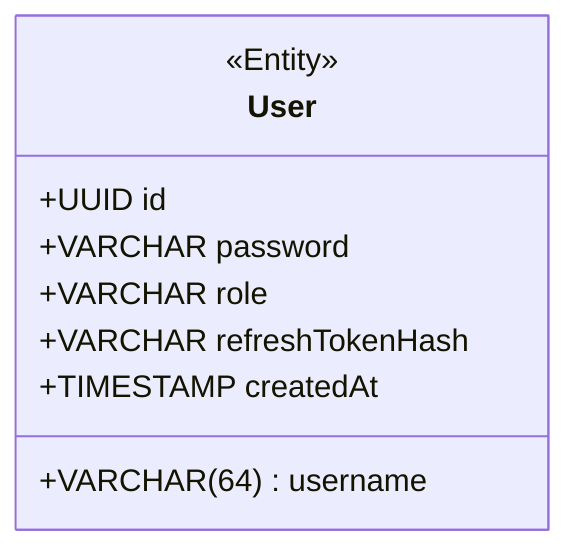
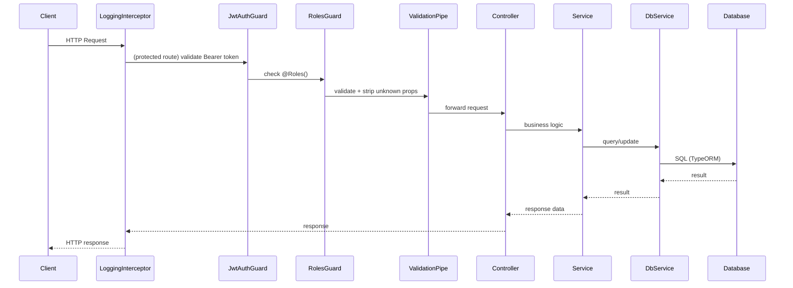
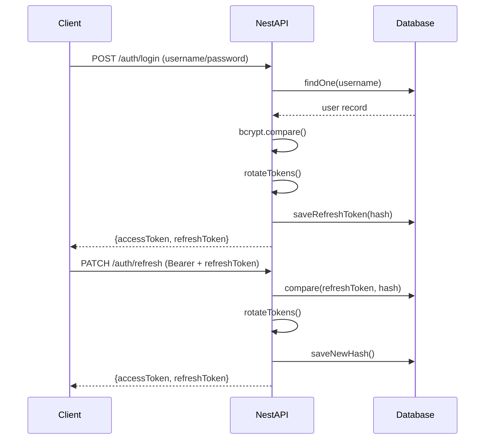

<div align="center">

# 🚀 NestJS Template

**A production-ready, opinionated NestJS backend template with JWT authentication, role-based access control, structured logging, and PostgreSQL persistence — ready to clone and extend.**

[](https://nestjs.com)
[](https://www.typescriptlang.org)
[](https://nodejs.org)
[](https://postgresql.org)
[](https://jestjs.io)
[](https://opensource.org/licenses/MIT)

[](https://eslint.org)
[](https://www.npmjs.com/package/bcrypt)
[](https://typeorm.io)
[](https://socket.io)

</div>

---

## 📋 Table of Contents

- [✨ Features](#-features)
- [🏗️ Tech Stack](#️-tech-stack)
- [🎯 Opinionated Decisions](#-opinionated-decisions)
- [📐 Architecture](#-architecture)
- [⚡ Quickstart](#-quickstart)
- [🔐 Environment Variables](#-environment-variables)
- [📡 API Reference](#-api-reference)
- [🔑 Authentication Flow](#-authentication-flow)
- [🛡️ Role-Based Access Control](#️-role-based-access-control)
- [📝 Logging](#-logging)
- [🧪 Testing](#-testing)
- [🤝 Contributing](#-contributing)
- [📄 License](#-license)

---

## ✨ Features

| Feature | Description |
|---|---|
| 🔐 **JWT Auth** | Access + refresh token rotation with bcrypt-hashed token storage |
| 🛡️ **RBAC** | Decorator-driven role-based access control (`admin`, `user`) |
| 🗄️ **TypeORM + SQLite** | Zero-config local persistence via SQLite; swap to Postgres/MySQL easily |
| ✅ **Validation** | `class-validator` with strict password policy enforcement |
| 📝 **Structured Logging** | File-based multi-channel logs (combined, error, stats) + HTTP interceptor |
| ❤️ **Health Checks** | `/health` endpoint with live database connectivity probe |
| 🔌 **WebSocket Ready** | `socket.io` and `@nestjs/websockets` pre-installed and configured |
| 🧪 **Testing** | Jest unit tests with mocked repositories; coverage reports included |
| 🔒 **Timing-Attack Prevention** | Constant-time hash comparison even for non-existent users |

---

## 🏗️ Tech Stack

<div align="center">

| Layer | Technology |
|---|---|
| **Framework** | [NestJS 11](https://nestjs.com) |
| **Language** | [TypeScript 5.7](https://www.typescriptlang.org) |
| **ORM** | [TypeORM 0.3](https://typeorm.io) |
| **Database** | [PostgreSQL](https://postgresql.org) (swappable) |
| **Auth** | [@nestjs/jwt](https://github.com/nestjs/jwt) + [bcrypt](https://www.npmjs.com/package/bcrypt) |
| **Validation** | [class-validator](https://github.com/typestack/class-validator) + [class-transformer](https://github.com/typestack/class-transformer) |
| **WebSockets** | [Socket.io 4](https://socket.io) |
| **Testing** | [Jest 30](https://jestjs.io) + [Supertest](https://github.com/ladjs/supertest) |
| **Linting** | [ESLint 9](https://eslint.org) (flat config) + [typescript-eslint](https://typescript-eslint.io) |

</div>

---

## 🎯 Opinionated Decisions

This template reflects specific architectural choices made to promote security, maintainability, and developer experience. Understanding these decisions will help you extend the template confidently.

### 🔐 Refresh Token Hashing

Refresh tokens are **never stored in plaintext**. After generation, the raw token is hashed with bcrypt (cost factor 10) before persisting to the database. Only the hash is stored in `user.refreshTokenHash`.

> **Why?** If your database is ever compromised, attackers cannot reuse refresh tokens. The raw token lives only in the HTTP response.

```
User logs in → raw tokens generated → refreshToken returned to client
                                     → refreshTokenHash saved to DB
```

### ⏱️ Timing Attack Prevention in Login

When a user provides an unknown username, the service still performs a `bcrypt.compare()` call against a dummy hash. This ensures login attempts for real and fake users take the same amount of time.

```typescript
// auth.service.ts
const comparisonHash = user ? user.password : '$2b$12$invalidhashinvalidhas$2b$12$invalidhashinvalidhas';
const isMatch = await bcrypt.compare(loginUserDto.password, comparisonHash);
```

> **Why?** Without this, an attacker could measure response time to enumerate valid usernames.

### 🔄 Token Rotation on Every Refresh

Every call to `PATCH /auth/refresh` issues a **brand new access + refresh token pair** and invalidates the previous refresh token hash in the database. Single-use refresh tokens prevent token replay attacks.

### 🧹 Whitelist Validation (DTO Stripping)

`ValidationPipe` is configured globally with `whitelist: true`. Any property sent in a request body that is **not declared in a DTO** is silently stripped before it reaches your controller.

```typescript
// main.ts
app.useGlobalPipes(new ValidationPipe({
  whitelist: true,       // Strip unknown properties
  transform: true,       // Auto-transform primitive types
  stopAtFirstError: true // Return first error only
}));
```

### 🔑 Strong Password Policy

Registration enforces a strict password policy via `class-validator`'s `@IsStrongPassword`:

- Minimum **12 characters**
- At least **1 uppercase** letter
- At least **1 lowercase** letter
- At least **1 number**
- At least **1 symbol**
- Maximum **128 characters** (prevents bcrypt DoS)

### 🆔 UUID Primary Keys

All user records use auto-generated **UUID v4** primary keys instead of sequential integers. This prevents ID enumeration attacks and simplifies horizontal scaling.

### 📁 File-Based Logging (No External Dependency)

Logging writes to three files in the `logs/` directory with zero external dependencies (no Elasticsearch, no Datadog). This keeps the template self-contained while providing enough structure to pipe into any logging platform.

### 🌐 CORS (Development Default)

CORS is currently open to all origins (`origin: true`). This is intentional for a development template. Before deploying to production, restrict this to your trusted origins:

```typescript
// main.ts — update before production
app.enableCors({
  origin: ['https://your-frontend.com'],
  credentials: true,
});
```

---

## 📐 Architecture

### Module Structure

```
src/
├── main.ts                          # Bootstrap: logger, pipes, CORS, port
└── modules/
    ├── app.module.ts                # Root module (imports all feature modules)
    ├── auth/                        # Authentication (login, register, refresh)
    │   ├── auth.controller.ts
    │   ├── auth.service.ts
    │   ├── auth.module.ts
    │   ├── guard/
    │   │   ├── jwt-auth.guard.ts    # Validates Bearer tokens on protected routes
    │   │   └── body-required.guard.ts
    │   └── dto/
    │       ├── CreateUser.dto.ts    # Strict password validation rules
    │       ├── loginUser.dto.ts
    │       └── refreshUserTokens.dto.ts
    ├── users/                       # User management (CRUD, role-protected)
    │   ├── users.controller.ts
    │   └── users.module.ts
    ├── roles/                       # Role management module
    │   ├── roles.controller.ts
    │   ├── roles.service.ts
    │   └── roles.module.ts
    ├── db/                          # Database abstraction (TypeORM operations)
    │   ├── db.service.ts
    │   ├── db.module.ts
    │   ├── db.service.spec.ts
    │   └── utils/
    │       └── userConversion.ts
    ├── jwt/                         # JWT token generation & validation
    │   ├── jwt.service.ts
    │   └── jwt.module.ts
    └── common/                      # Shared utilities, guards, entities, logging
        ├── entities/
        │   └── user.entity.ts       # TypeORM User entity (UUID, unique username)
        ├── flow/
        │   ├── roles.guard.ts       # RBAC guard (checks @Roles() decorator)
        │   └── roles.decorator.ts   # @Roles('admin') decorator
        ├── health/
        │   └── controller/
        │       └── health.controller.ts
        ├── logging/
        │   ├── services/
        │   │   └── logger.service.ts
        │   └── interceptors/
        │       └── logging.interceptor.ts
        └── utils/
            ├── roleChecker.ts
            └── userRole.enum.ts
```

### Data Model



### Request Lifecycle



---

## ⚡ Quickstart

### Prerequisites

- **Node.js** ≥ 18 ([download](https://nodejs.org))
- **npm** ≥ 9

### 1. Clone & Install

```bash
git clone https://github.com/DiamondJdev/NestJSTemplate.git my-app
cd my-app
npm install
```

### 2. Configure Environment

```bash
cp .env.example .env
```

Edit `.env` with your secrets (see [Environment Variables](#-environment-variables) below).

> **Note:** A `.env.example` file is provided as a template. The app will start on port `5200` by default if `PORT` is not set.

### 3. Start the Development Server

```bash
npm run dev
```

The dev server starts at **`http://localhost:8080`**. In production (`npm start` / `npm run start:prod`), the server listens on the port defined by `PORT` in your `.env` file, which defaults to **`5200`**.

### 4. Verify It's Working

```bash
curl http://localhost:8080/
# → {"message":"OK","version":"1.0.0","database":{"status":"connected","latency":12},"backend":{"status":"running","uptime":123456},"timestamp":"2025-01-01T00:00:00.000Z","mode":"development"}
```

### 5. Register Your First User

```bash
curl -X POST http://localhost:8080/auth/register \
  -H "Content-Type: application/json" \
  -d '{
    "username": "adminuser",
    "password": "MyStr0ng!Password"
  }'
```

**Example Response:**

```json
{
  "message": "User registered successfully",
  "userID": "550e8400-e29b-41d4-a716-446655440000",
  "accessToken": "eyJhbGciOiJIUzI1NiIsInR5cCI6IkpXVCJ9...",
  "refreshToken": "eyJhbGciOiJIUzI1NiIsInR5cCI6IkpXVCJ9..."
}
```

### 6. Access a Protected Route

```bash
curl http://localhost:8080/auth/me \
  -H "Authorization: Bearer <your-access-token>"
```

---

## 🔐 Environment Variables

Create a `.env` file in the project root. The application reads all config via `@nestjs/config`.

| Variable | Required | Default | Description |
|---|---|---|---|
| `PORT` | No | `5200` | HTTP server port |
| `DB_HOST` | No | `localhost` | PostgreSQL host |
| `DB_PORT` | No | `5432` | PostgreSQL port |
| `DB_USERNAME` | No | `postgres` | PostgreSQL username |
| `DB_PASSWORD` | **Yes** | — | PostgreSQL password |
| `DB_NAME` | No | `margin_dev` | PostgreSQL database name |
| `JWT_SECRET` | **Yes** | — | Secret key for signing access tokens |
| `JWT_ACCESS_EXP` | No | `15m` | Access token TTL (e.g., `15m`, `1h`) |
| `JWT_REFRESH_EXP` | No | `7d` | Refresh token TTL (e.g., `7d`, `30d`) |
| `NODE_ENV` | No | `development` | Set to `production` to suppress console logs |

**`.env.example`:**

```env
PORT=5200

# Generate a strong secret: openssl rand -hex 64
JWT_SECRET=your-super-secret-key-change-me-in-production
JWT_ACCESS_EXP=15m
JWT_REFRESH_EXP=7d

NODE_ENV=development
```

> ⚠️ **Never commit your `.env` file.** It is already included in `.gitignore`.

---

## 📡 API Reference

Base URL (development – `npm run start:dev`): `http://localhost:8080`

For production or when running `npm start`, the base URL is `http://localhost:5200` (or `http://localhost:${PORT}` if you change the `PORT` value).
### Authentication

| Method | Endpoint | Auth | Body | Description |
|---|---|---|---|---|
| `POST` | `/auth/register` | None | `{ username, password }` | Create a new account |
| `POST` | `/auth/login` | None | `{ username, password }` | Authenticate and receive tokens |
| `PATCH` | `/auth/refresh` | Bearer (access) | `{ refreshToken }` | Rotate access + refresh tokens |
| `GET` | `/auth/me` | Bearer (access) | — | Check if the current token is valid |

### Users

| Method | Endpoint | Auth | Roles | Description |
|---|---|---|---|---|
| `GET` | `/users` | Bearer | `admin` | List all users |
| `GET` | `/users/me` | Bearer | Any | Get current user's details |
| `PATCH` | `/users/:uuid` | Bearer | Any* | Update user by UUID |
| `DELETE` | `/users/:uuid` | Bearer | `admin` | Delete user by UUID |

> *Users can only update their own profile; admins can update any profile.

### Health

| Method | Endpoint | Auth | Description |
|---|---|---|---|
| `GET` | `/` | None | Returns server status and DB connectivity |

**Health response example:**

```json
{
  "status": "ok",
  "database": {
    "status": "connected",
    "latencyMs": 12
  },
  "backend": {
    "uptimeSeconds": 12345,
    "version": "1.0.0",
    "mode": "production"
  },
  "timestamp": "2025-01-01T12:00:00.000Z"
}
```

---

### Request / Response Examples

<details>
<summary><strong>POST /auth/login</strong></summary>

**Request:**
```json
{
  "username": "myuser",
  "password": "MyStr0ng!Password"
}
```

**Success (200):**
```json
{
  "message": "User logged in successfully",
  "userID": "550e8400-e29b-41d4-a716-446655440000",
  "accessToken": "eyJhbGciOiJIUzI1NiIsInR5cCI6IkpXVCJ9...",
  "refreshToken": "eyJhbGciOiJIUzI1NiIsInR5cCI6IkpXVCJ9..."
}
```

**Failure (401):**
```json
{
  "statusCode": 401,
  "message": "Invalid Username or Password"
}
```

</details>

<details>
<summary><strong>PATCH /auth/refresh</strong></summary>

**Request** (with `Authorization: Bearer <accessToken>` header):
```json
{
  "refreshToken": "eyJhbGciOiJIUzI1NiIsInR5cCI6IkpXVCJ9..."
}
```

**Success (200):**
```json
{
  "message": "Token refreshed successfully",
  "accessToken": "eyJhbGciOiJIUzI1NiIsInR5cCI6IkpXVCJ9...",
  "refreshToken": "eyJhbGciOiJIUzI1NiIsInR5cCI6IkpXVCJ9..."
}
```

</details>

---

## 🔑 Authentication Flow

This template uses a **dual-token** authentication strategy:



**Token Details:**

| Token | Algorithm | Default Expiry | Storage |
|---|---|---|---|
| Access Token | HS256 | 15 minutes | Client memory / header |
| Refresh Token | HS256 | 7 days | Client (secure cookie / local) |
| Refresh Token Hash | bcrypt (cost 10) | — | Database (`refreshTokenHash` column) |

---

## 🛡️ Role-Based Access Control

The template ships with two roles defined in `userRole.enum.ts`:

```typescript
enum UserRole {
  ADMIN = 'admin',
  USER  = 'user',
}
```

Roles are enforced using a custom decorator + guard combination:

```typescript
// Apply to any controller or route handler
@Roles('admin')
@UseGuards(JwtAuthGuard, RolesGuard)
@Get()
findAll() { ... }
```

**How it works:**

1. `JwtAuthGuard` validates the Bearer token and attaches `req.user` (with `id` and `role`).
2. `RolesGuard` reads the `@Roles()` metadata and compares it against `req.user.role`.
3. If the role does not match, a `403 Forbidden` response is returned.

**Default Role Assignment:**

All newly registered users are assigned the `user` role. Admin accounts must be promoted manually (via direct DB update or a dedicated admin endpoint that you add to your project).

---

## 📝 Logging

The template includes a zero-dependency, file-based logging system.

### Log Files

All files are written to the `logs/` directory (auto-created, excluded from git):

| File | Contents |
|---|---|
| `logs/combined.log` | All log levels |
| `logs/error.log` | Errors and warnings only |
| `logs/stats.log` | User activity events (login, registration, etc.) |

### Log Format

```
2026-02-11T17:50:00.123Z [INFO][Bootstrap] Server running on http://0.0.0.0:5200
2026-02-11T17:50:01.456Z [INFO][HTTP] GET /users 200 {"duration":"12ms","userId":"abc-123"}
2026-02-11T17:50:02.789Z [ERROR][AuthService] Invalid credentials {"trace":"Error: ..."}
2026-02-11T17:50:03.012Z [INFO][UserStats] User abc-123 - login {"ip":"127.0.0.1"}
```

### HTTP Request Logging

All incoming requests are automatically logged by `LoggingInterceptor` (applied globally). No manual configuration is needed. Each log entry includes:

- HTTP method and URL
- Response status code
- Response time (ms)
- User ID (if authenticated)

### Using the Logger in Your Code

```typescript
// Adjust the import path based on your file's location or configured path aliases
import { LoggerService } from 'src/modules/common/logging/services/logger.service';

@Injectable()
export class MyService {
  constructor(private readonly logger: LoggerService) {}

  doSomething() {
    this.logger.log('Info message', 'MyService');
    this.logger.warn('Warning message', 'MyService');
    this.logger.error('Error message', error.stack, 'MyService');

    // Log user actions to stats.log
    this.logger.logUserStats('purchase', userId, { amount: 9.99 });
  }
}
```

---

## 🧪 Testing

```bash
# Run all unit tests
npm test

# Run tests in watch mode
npm run test:watch

# Run tests with coverage report
npm run test:cov

# Run end-to-end tests
npm run test:e2e
```

### Test Structure

Tests live alongside the source files (`*.spec.ts`):

```
src/modules/db/db.service.spec.ts              # DbService unit tests
src/modules/common/health/controller/
    health.controller.spec.ts                  # HealthController unit tests
```

Tests use Jest with `@nestjs/testing` and mocked TypeORM repositories — no real database is required to run the test suite.

**Example test approach:**

```typescript
// Repositories are mocked with jest.fn() factories
const mockRepository = {
  findOne: jest.fn(),
  save: jest.fn(),
  delete: jest.fn(),
};

const module = await Test.createTestingModule({
  providers: [
    DbService,
    { provide: getRepositoryToken(User), useValue: mockRepository },
  ],
}).compile();
```

---

## 🔌 WebSocket Support

Socket.io and `@nestjs/websockets` are pre-installed. To add a WebSocket gateway:

```bash
nest generate gateway modules/events
```

This will scaffold a gateway class in `src/modules/events/` that you can extend with your real-time logic.

---

## 🤝 Contributing

Contributions are welcome! Please follow these steps:

1. Clone the repo `git clone <url>.git`
2. Create a feature branch: `git checkout -b feat/my-feature`
3. Make your changes and add tests where appropriate
4. Ensure all tests pass: `npm test`
5. Lint your code: `npm run lint`
6. Open a Pull Request describing your changes
